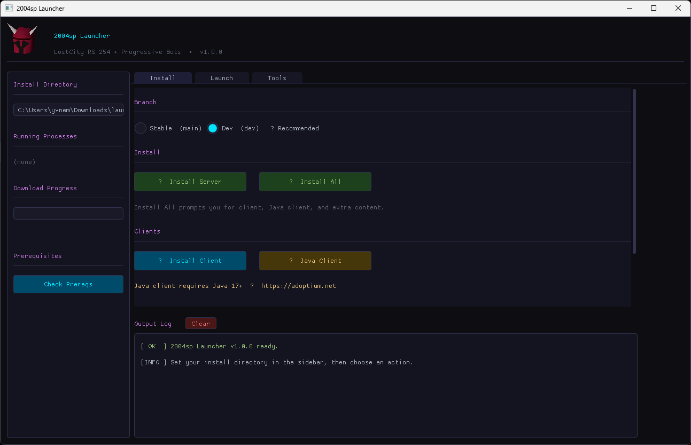

# 2004sp Launcher

A graphical installer and server manager for **LostCity RS 254 + Progressive Bots**.



---

## What it does

The launcher replaces the old batch/script-based setup with a single GUI that handles everything:

**Install tab**
- Clones and installs the LostCity RS 254 server (Engine-TS, Content, Server repos) on either the `stable` (main) or `dev` branch
- Downloads the 2004sp native client for your platform (Windows/macOS/Linux)
- Downloads the Progressive Java Client (`.jar`)
- Installs extra content (additional items, capes, etc.)
- One-click **Install All** walks you through all of the above with prompts

**Launch tab**
- Start / stop the game server, hiscores service, friend server, logger, and login server
- Dev mode and quickstart shortcuts
- Build and clean the server, run interactive setup — each in a new terminal window

**Tools tab**
- **Patch `.env`** — sets `NODE_CLIENT_ROUTEFINDER=false` and `BUILD_VERIFY=false` for offline single-player mode
- **Import Character** — registers a `.sav` file as a playable account in the server database
- **Change Password** — updates the bcrypt password for an existing account

The sidebar shows the current install directory, any running processes, and a download progress bar.

---

## Prerequisites

These must be installed and available on your `PATH` before using the launcher:

| Tool | Minimum version | Notes |
|------|----------------|-------|
| **Git** | any recent | Used to clone/pull all server repos |
| **Node.js** | 18+ recommended | Required to run the server |
| **npm** | bundled with Node | Used to install server dependencies |
| **Java** | 17+ | Only required to run the **Java client** — get it at [adoptium.net](https://adoptium.net) |

Use the **Check Prereqs** button in the sidebar to verify that Git, Node, and npm are found correctly.

---

## Running from source

```bash
pip install -r requirements.txt
python launcher.py
```

## Pre-built binaries

Download the latest release for your platform from the [Releases](../../releases) page — no Python installation needed.
